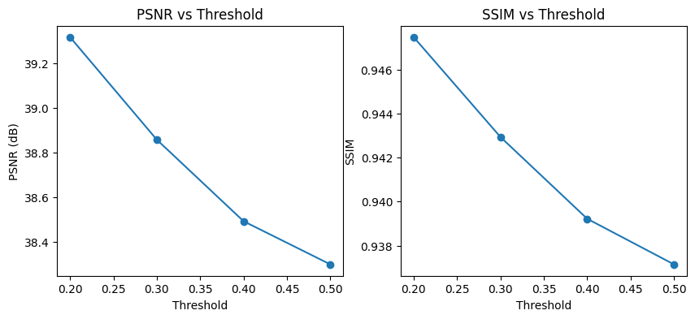

# Saliency-Based Region-Adaptive Image Compression (JPEG-style)

**Course:** CSCI 6351 — Data Compression 


**Author:** Laman Guluzade


**Repository:** `saliency-image-compression`

## 1. Project Overview

The purpose of this project was to implement a **lossy image compression system based on JPEG**, and extend that system to use **region-adaptive quantization based on saliency**; i.e., to **allocate bits intelligently so that visually important regions are preserved while less important regions are compressed more**.

This project was concerned with the **mechanics of compression**, rather than just "compressing an image file", i.e., block-based transform (**DCT**) → **quantization** → **reconstruct** → **evaluate quality**.

In addition to evaluating the **quality of the reconstructed image** (using PSNR and SSIM), the project includes **analysis from a compression perspective**, specifically:

* **the sparsity/zero-ratio of the DCT coefficients after quantizing** (a proxy for how much the bitrate has been reduced)

* **frequency subband analysis** (e.g., low-frequency, mid-frequency, high-frequency), to demonstrate **where** compression removed information.
---

## 2. Key Ideas (Why this project matters)

### 2.1 JPEG is frequency-based

JPEG transforms an 8x8 block of a spatial image into its frequency components via **DCT**. Most images are comprised of a great deal of their energy at lower frequency bands; therefore, higher frequency coefficient can generally be heavily quantized or be zeroed-out without significant loss of perceived quality.


### 2.2 Perceptual compression: not all pixels matter equally

A saliency map attempts to model where human visual attention is likely to be directed on an image.

This leads to **adaptive bit allocation**:

• **Saliency maps direct toward finer quantization (preserves details)**

• **Non-saliency areas direct toward coarser quantization (saves space)**

---

## 3. What I implemented

### 3.1 Baseline JPEG-style compression

Implemented a standard pipeline:

1. Convert image to grayscale (in experiments)
2. Pad image so dimensions are multiples of 8
3. Split into non-overlapping **8×8 blocks**
4. Apply **DCT** (`cv2.dct`) per block
5. Apply **uniform quantization** using a fixed table (`FINE_Q`)
6. Dequantize
7. Apply inverse DCT (`cv2.idct`)
8. Reconstruct image from blocks

**Output:** reconstructed baseline compressed image.

---

### 3.2 Saliency-based adaptive compression (main contribution)

Expanded on Baseline by Computing a Saliency Map and Selecting Quantization Strength **Per Block**:

1. Calculate A Pixel-Level Saliency Map

2. Determine The Block-Level Saliency Score (Mean Saliency Per 8X8 Block)

3. For Each 8x8 Block:

* If Saliency is Greater Than or Equal to Threshold Use `FINE_Q`, Otherwise Use `COARSE_Q`.

The Proposed Method Contains a Tunable Parameter.

* Lower Value for `Threshold`: More Blocks Treated as Salient = Higher Quality, Less Compression

* Higher Value for `Threshold`: Fewer Salient Blocks = Stronger Compression, Lower Quality
---

### 3.3 Frequency-aware adaptive quantization (additional analysis extension)

I've added another analysis mode that supports the "frequency perspective" from the course material: **Adaptive + Frequency**.

In contrast to the **Adaptive** mode, which assigns one quantization table for each block, this mode has the ability to adjust the quantization strength based on **coefficient locations** (i.e., whether the coefficients represent low or high frequencies) in the most important areas (salient):

* low frequencies preserved more,
* high frequencies quantized more aggressively.

The goal of this analysis mode was not to replace the primary project (adaptive compression based on salience), rather it was intended to be used as a tool to explore how a frequency domain compression scheme can be further refined and analyzed.
---

## 4. Evaluation Metrics

### 4.1 Image quality metrics

* **PSNR** (Peak Signal-to-Noise Ratio)
* **SSIM** (Structural Similarity Index)

These measure reconstruction fidelity relative to the original padded image.

### 4.2 Compression proxy: sparsity / zero ratio

Instead of implementing full entropy coding (Huffman/RLE), I measure **percentage of zeros in quantized DCT coefficients**, which is a strong proxy for compressibility:

* More zeros → better entropy coding efficiency → lower bitrate expected.

I compute:

* Zero ratio over all coefficients
* Zero ratio excluding DC coefficient (AC-only), because AC coefficients dominate texture/detail content.

### 4.3 Frequency / subband analysis

I compute zero ratios separately for:

* **low-frequency subband**
* **mid-frequency subband**
* **high-frequency subband**

This shows where compression removes information and how the adaptive strategies affect frequency content.

---

## 5. Experiments

### 5.1 Threshold sweep (saliency threshold vs quality)

I tested multiple thresholds (e.g., `0.2, 0.3, 0.4, 0.5`) and recorded PSNR/SSIM.
This demonstrates the **rate–distortion trade-off behavior** of the adaptive method.

As illustrated in *figure 1*, an increase in the saliency threshold results in a reduction in the number of blocks identified as salient, thus resulting in more aggressive quantization being performed in areas that are not identified as salient. The degradation in both PSNR and SSIM is smooth and monotonic, indicating a controllable and well behaved rate-distortion trade off for the proposed saliency-based adaptive quantizer.


Figure 1.

### 5.2 Multiple images evaluation

I evaluated baseline vs adaptive on multiple input images located in `images/`:

* `sample1.jpg`
* `sample2.jpg`
* `sample3.png`
* `sample4.jpg`

### 5.3 Sparsity comparison

For each image:

* compute quantized DCT blocks (baseline/adaptive)
* compute zero ratios (all vs AC-only)
* interpret higher sparsity as higher expected compression

### 5.4 Subband (frequency) sparsity comparison

For each image:

* compute quantized DCT blocks under different modes
* compute low/mid/high subband zero ratios
* observe that high-frequency coefficients are most aggressively zeroed.

---

## 6. Results Summary (example)

> Actual results will appear when it is run through notebook. Below illustrates the output format and author's experiments.


### 6.1 Quality Metrics (PSNR / SSIM)
The reconstruction quality for four test images is shown in Table 1:

Baseline JPEG consistently achieves better PSNR and SSIM scores than the proposed saliency based adaptive method (with the exception of the last one) with respect to the quality loss due to uniform finer quantization for each block.

Depending on the content and the degree of the complexity of the textures of the tested images, the proposed saliency-based adaptive method causes a controlled deterioration in the quality of the reconstruction:
- PSNR decreases by approximately 2–7 dB depending on image content and texture complexity.
- SSIM decreases by 0.03–0.17 depending on image content

For example:
- On *sample1.jpg*, PSNR drops from **45.26 dB** (baseline) to **38.66 dB** (adaptive), while SSIM decreases from **0.982** to **0.941**.
- On more texture-rich images (e.g., *sample4.jpg*), the quality drop is more pronounced, reflecting stronger compression in non-salient regions.

Table 1:

| Image   | Baseline PSNR | Adaptive PSNR | Drop         |
| ------- | ------------- | ------------- | ------------ |
| sample1 | 45.26         | 38.66         | ≈ **6.6 dB** |
| sample2 | 35.44         | 32.17         | ≈ **3.3 dB** |
| sample3 | 30.05         | 27.64         | ≈ **2.4 dB** |
| sample4 | 35.66         | 31.03         | ≈ **4.6 dB** |


### 6.2 Sparsity (zero ratio)

Adaptive produces higher zero-ratio than baseline across images, indicating better compressibility.

| Image   | Baseline | Adaptive   |
| ------- | -------- | ---------- |
| sample1 | 94.95%   | **97.61%** |
| sample2 | 92.13%   | **95.57%** |
| sample4 | 90.62%   | **94.95%** |


### 6.3 Frequency Perspective (Subband Analysis)

Zero ratios were calculated separately for low, mid and high frequency DCT subbands, using quantized coefficients, to see where the gain in sparseness occurs in the frequency domain.

JPEG has a very high level of sparseness in its high frequency bands (≈99.9%) and this is due to the nature of how JPEG applies standard quantization to these bands.

In contrast, the adaptive algorithms cause a large increase in the sparseness of the **lower and middle frequency bands**, that would be otherwise preserved by standard JPEG:

- Low-frequency zero ratio increases from **0.33** (baseline) to **0.70** (adaptive)
- Mid-frequency zero ratio increases from **0.97** to **0.999**
- High-frequency coefficients remain almost entirely zero for all methods

The adaptive algorithms selectively discard the lower and mid-frequency components in regions where there is no salience; therefore they have an additional effect on compression over the standard JPEG behavior.

---

## 7. Repository Structure

```
saliency-image-compression/
├── images/                 # input images for experiments
├── notebooks/
│   └── experiment.ipynb    # main experiment notebook 
├── src/
│   ├── dct.py              # DCT, block split, reconstruction
│   ├── quantization.py     # quantization tables and (de)quantization
│   ├── saliency.py         # saliency map computation
│   ├── utils.py            # padding helper
│   ├── adaptive_compression.py  # baseline + adaptive compression + evaluation
│   └── analysis/
│       ├── sparsity.py     # zero-ratio / sparsity functions
│       └── frequency.py    # subband / frequency-domain analysis helpers
├── requirements.txt
└── README.md
```

---

## 8. How to Run 

### 8.1 Clone the repository

```bash
!git clone https://github.com/lmn-glzd/saliency-image-compression.git
```

### 8.2 Install dependencies (recommended stable versions)

```bash
!pip install numpy==1.26.4 opencv-python-headless==4.7.0.72 scikit-image matplotlib
```

### 8.3 Add repo to Python path

```python
import sys
sys.path.append('/content/saliency-image-compression')
sys.path.append('/content/saliency-image-compression/src')
print("PATH ready")
```

### 8.4 Run the notebook

Open:

* `notebooks/experiment.ipynb`

Run from top to bottom to reproduce:

* baseline compression
* adaptive compression
* threshold sweep
* multi-image evaluation
* sparsity analysis
* frequency/subband analysis

---

## 9. Notes & Design Choices

* **Block size fixed to 8×8** to mirror JPEG.
* **Entropy coding is not explicitly implemented**; instead, sparsity of quantized DCT coefficients is used as a bitrate proxy.
* Images are padded to match block size requirements.
* The project emphasizes **learning outcomes**:

  * transform coding behavior,
  * quantization effects,
  * perceptual (HVS) bit allocation,
  * frequency-domain analysis.

---

## 10. Conclusion

The project demonstrates that JPEG-style DCT-based pipelines can be improved through use of saliency-guided adaptive quantization which will provide a direct trade-off for perceived quality versus compression ratio. The sparsity and sub-band analysis results demonstrate the compression perspective on how an adaptive strategy affects frequency content as well as the resulting expected bitrate.

---

## 11. Future Work 

There are potential future research projects in each of the above areas:
* Adding a simple entropy coding layer (RLE + Huffman) to estimate the actual bitrate.
* Expanding to full-color YCbCr compression rather than grayscale compression.
* Evaluating the performance of multiple saliency models by performing perceptual evaluations through user studies.

---

